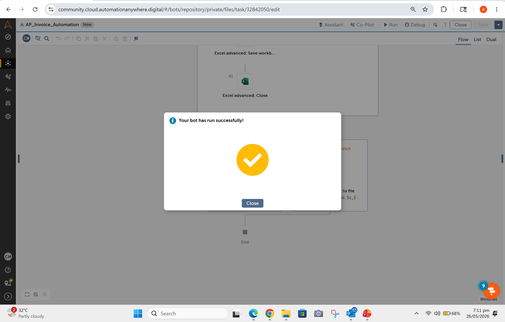
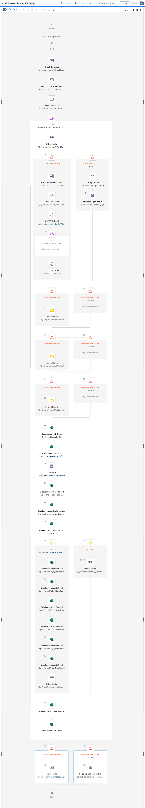
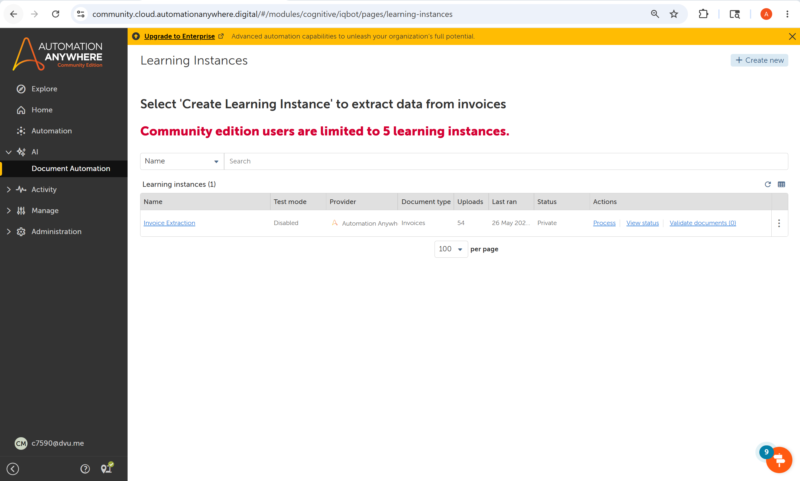
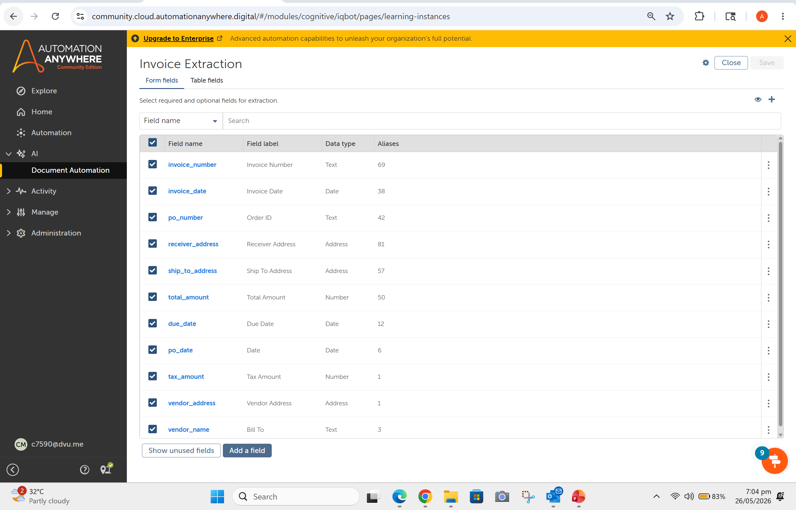
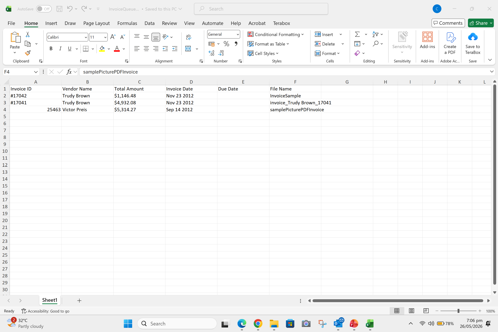
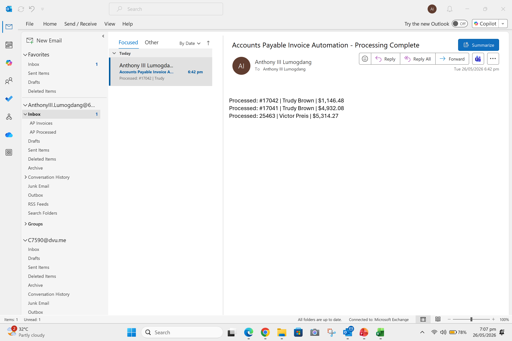

# Accounts Payable Invoice Automation with AI-Powered IQ Bot
### Built with Automation Anywhere Community Edition



---

## 📋 Project Overview

This project automates the end-to-end Accounts Payable (AP) invoice processing workflow using **Automation Anywhere Community Edition** with **IQ Bot AI-powered document extraction**. The bot monitors an Outlook inbox, extracts invoice data from email attachments using AI, performs duplicate detection, writes results to an Excel queue, and sends a formatted notification email — all without human intervention.

---

## 🎬 Demo

▶️ [Watch the full demo video](demo/AP_Invoice_Automation_Demo_AutomationAnywhere.mp4)

---

## 🤖 Bot Workflow

```
📧 Email arrives with invoice attachments
         ↓
📁 Save attachments from AP Invoices folder
         ↓
📨 Move email to AP Processed folder
         ↓
🔁 Loop through each saved file
         ↓
🧠 IQ Bot AI extracts invoice fields
         ↓
📄 Read extracted data from CSV output
         ↓
🔍 Check for duplicate Invoice Number in Excel
         ↓
    ┌────┴────┐
 Not Dup    Duplicate
    ↓          ↓
📊 Write    ⏭️ Skip &
 to Excel    Log
    ↓
💾 Save Excel Queue
         ↓
📧 Send notification email with summary
         ↓
✅ Done
```

---

## ✨ Key Features

- **AI Invoice Extraction** — Uses Automation Anywhere IQ Bot with a pre-trained invoice model to extract fields from PDFs and images
- **Multi-format Support** — Processes PDF, JPG, PNG, and TIFF invoice attachments
- **Duplicate Detection** — Checks Invoice ID against existing Excel queue before writing
- **Dynamic Excel Navigation** — Uses `Excel Advanced: Go to next empty cell` for reliable row insertion without hardcoded row numbers
- **Structured Error Handling** — Try/Catch blocks around IQ Bot extraction and email sending, with errors logged to a timestamped `ErrorLog.txt`
- **Notification Email** — Sends a formatted processing summary email after each run
- **Bot-level Configuration** — All folder paths and settings stored as bot variables for easy deployment updates

---

## 📊 Extracted Invoice Fields

| Field | Source Column in CSV |
|-------|---------------------|
| Invoice ID | invoice_number |
| Vendor Name | vendor_name |
| Total Amount | total_amount |
| Invoice Date | invoice_date |
| Due Date | due_date |
| File Name | (from loop variable) |

---

## 🛠️ Tech Stack

| Component | Technology |
|-----------|-----------|
| RPA Platform | Automation Anywhere Community Edition |
| AI Extraction | IQ Bot Extraction360 (Pre-trained Invoice Model) |
| Email Integration | Outlook Classic Desktop (via Email package) |
| Data Storage | Microsoft Excel (.xlsx) |
| Document Processing | IQ Bot Learning Instance — CSV output |
| Error Logging | Automation Anywhere Logging package |

---

## 🎯 Skills Demonstrated

### RPA Development
- **Bot Design & Development** — Built a production-grade task bot from scratch in Automation Anywhere Automation 360
- **Control Flow** — Loops, conditionals (If/Else), error handlers (Try/Catch), nested logic
- **Variable Management** — String, Number, Boolean, List, Table, Record, and Dictionary variable types
- **Inline Type Coercion** — Used AA's built-in type conversion chain for dynamic Excel navigation without extra variables
- **Session Management** — Email and Excel sessions with proper open/close lifecycle management
- **Bot-level Configuration** — Centralized configuration via bot variables following Enterprise deployment standards

### AI & Document Processing
- **IQ Bot Learning Instance Setup** — Configured a pre-trained AI invoice extraction model with custom field mapping and aliases
- **Document Understanding** — Mapped and extracted structured data from unstructured PDF and image documents
- **AI Model Tuning** — Added custom aliases to vendor_name field to improve extraction accuracy for non-standard invoice layouts
- **CSV Pipeline** — Implemented a CSV/Data Table pipeline to reliably read IQ Bot extraction output

### Email Automation
- **Outlook Integration** — Connected to Outlook Classic desktop app without IMAP credentials using Windows session authentication
- **Folder-based Queue Management** — Implemented an inbox rule + folder-based processing queue (AP Invoices → AP Processed) as a trigger alternative
- **Automated Notifications** — Generated and sent formatted processing summary emails with line-by-line invoice results

### Excel Automation
- **Dynamic Row Navigation** — Used Excel Advanced Go to Next Empty Cell for reliable row insertion without hardcoded row numbers
- **Duplicate Detection** — Implemented Excel Find-based duplicate check with List Size evaluation
- **Workbook Management** — Open, read, write, save, and close Excel sessions within a loop

### Error Handling & Logging
- **Multi-level Error Handling** — Separate Try/Catch blocks for IQ Bot extraction and email sending
- **Graceful Degradation** — Bot continues processing remaining files when one fails, logs the error, and includes it in the notification summary
- **Timestamped Error Logging** — Appends errors to a persistent ErrorLog.txt using the Logging package
- **Error Variable Capture** — Used v_ErrorMessage and v_ErrorLine with inline .Number:toString conversion for detailed error reporting

### Problem Solving & Workarounds
- **Diagnosed and resolved** IQ Bot Extraction360 serialization bug on Community Edition
- **Designed alternative data pipeline** (CSV output reading) when direct record mapping failed
- **Implemented Outlook folder queue** as a real-time trigger alternative without Azure AD credentials
- **Adapted bot architecture** iteratively based on Community Edition constraints while maintaining Enterprise-ready design patterns

### Best Practices
- **Separation of concerns** — Email processing, AI extraction, duplicate detection, and notification are modular and independently error-handled
- **Clean variable naming** — Consistent v_ prefix convention throughout
- **Configuration over hardcoding** — All paths and settings in named variables
- **Security awareness** — Documented Credential Vault usage for Enterprise deployment; used Windows session auth to avoid storing credentials in bot
- **Code documentation** — Inline variable descriptions and structured README for maintainability

---

## ⚠️ Community Edition Limitations & Workarounds

This project was built on **Automation Anywhere Community Edition**, which has several restrictions compared to Enterprise. Below are the limitations encountered and the workarounds implemented:

### 1. ❌ No Credential Vault Access
**Limitation:** The Credential Manager/Vault under Administration is not available in Community Edition. Credentials cannot be securely stored centrally.

**Workaround:** Email connection uses the **Outlook Desktop tab** in the Email: Connect action, which authenticates via the logged-in Windows Outlook session — no credentials needed at all.

**Enterprise Deployment Note:** In Enterprise, credentials would be stored in the Control Room Credential Vault and referenced via the Credential package actions.

---

### 2. ❌ No Global Variables (Create Button Missing)
**Limitation:** The Global Values page under Manage does not have a Create button in Community Edition, preventing centralized configuration management.

**Workaround:** All configuration values (folder paths, email addresses) are stored as **bot-level variables with default values**. These are documented and easily swappable with Global Variables upon Enterprise deployment.

**Enterprise Deployment Note:**
```
## Configuration
Bot-level variables are used for development.
Upon Enterprise deployment, these are replaced
with Control Room Global Variables for centralized
configuration management per industry standards.
```

---

### 3. ❌ IQ Bot Extraction360 Record Response Bug
**Limitation:** When **IQ Bot Extraction360 [Preview]** is configured to return extracted fields via "Multiple variables" mapping, the response record does not contain the expected flat keys (e.g. `invoice_number`). The error returned is:

```
Key 'invoice_number' not found in record
```

When configured to save to local folder, the following serialization error occurs:
```
IQB_EXTRACT_FAILURE: Cannot deserialize value of type
'com.google.protobuf.DescriptorsSEnumDescriptor'
from String "DW_UPLOAD_SUCCESS"
```

**Workaround:** IQ Bot is configured to **upload to IQ Bot server** (which successfully processes the file and generates output). The bot then reads the **CSV file generated by IQ Bot** in the `Validation` subfolder of the output directory:

```
$v_OutputFolder$\Validation\$v_FileName$.csv
```

The CSV is opened using **CSV/TXT: Open** → read using **CSV/TXT: Read** into a `v_CSVData` Table variable → iterated using a **Loop: For each row in data table** with column header mapping directly to variables.

**Enterprise Deployment Note:** In Enterprise, the IQ Bot record response works correctly and the Multiple variables mapping can be used directly without the CSV workaround.

---

### 4. ❌ No Email Trigger (Requires Azure AD / IMAP Credentials)
**Limitation:** Both the Email trigger (requires IMAP with Credential Store) and Microsoft 365 Outlook trigger (requires Azure AD app registration with Client ID, Tenant ID, Client Secret) are not configurable in Community Edition without Enterprise features.

**Workaround:** Bot runs on a **scheduled/manual basis**. An **Outlook rule** automatically moves incoming invoice emails to a dedicated `AP Invoices` folder. The bot processes all emails in that folder each run, then moves them to `AP Processed` to prevent reprocessing.

**Enterprise Deployment Note:** In Enterprise, an email trigger would be configured for real-time processing as emails arrive.

---

### 5. ❌ No Bot Export
**Limitation:** Community Edition does not support native bot export from the Control Room.

**Workaround:** Bot content was extracted using the **AA360 Bot Assistant Chrome Extension** (Content Modification → Copy JSON), saved as `AP_Invoice_Automation.json` and uploaded to this repository.

---

## 🏗️ Bot Architecture

```
AP_Invoice_Automation
│
├── Email: Connect (Outlook Desktop)
├── Email: Save all attachments (AP Invoices → local folder)
├── Email: Move all (AP Invoices → AP Processed)
│
└── Loop: For each file in Invoices folder
    │
    ├── String: Assign (build file path)
    │
    ├── Error handler: Try
    │   ├── IQ Bot Extraction360: Extract data
    │   ├── CSV/TXT: Open (Validation CSV output)
    │   ├── CSV/TXT: Read → v_CSVData (Table)
    │   └── Loop: For each row → map to variables
    │
    ├── Error handler: Catch
    │   ├── String: Assign (log error to summary)
    │   └── Logging: Log text to file (ErrorLog.txt)
    │
    ├── Excel advanced: Open (InvoiceQueue.xlsx)
    ├── Excel advanced: Find (duplicate check)
    ├── List: Size (count matches)
    │
    ├── If: not duplicate
    │   ├── Excel advanced: Go to cell A1
    │   ├── Excel advanced: Go to next empty cell (down)
    │   ├── Excel basic: Set cell × 6 (write invoice data)
    │   ├── Excel basic: Save workbook
    │   └── String: Assign (append to email summary)
    │
    ├── If: Else (duplicate)
    │   └── String: Assign (log duplicate to summary)
    │
    └── Excel advanced: Close
        Folder: Delete (clean up IQ Bot output)
│
├── Error handler: Try
│   └── Email: Send (notification with summary)
│
└── Error handler: Catch
    └── Logging: Log text to file (email send failure)
```

---

## 📁 Repository Structure

```
Accounts_Payable_Process_Automation_with_AI_IQ_Bot-AutomationAnywhere/
│
├── README.md
│
├── bot/
│   └── AP_Invoice_Automation.json       ← Bot exported via Bot Assistant
│
├── demo/
│   └── AP_Invoice_Automation_Demo_AutomationAnywhere.mp4
│
├── screenshots/
│   ├── 01_bot_flow.png
│   ├── 02a_iqbot_learning_instance_overview.png
│   ├── 02b_iqbot_field_configuration.png
│   ├── 02c_iqbot_processing_requests.png
│   ├── 03_excel_output.png
│   ├── 04_email_notification.png
│   └── 05_bot_success.png
│
└── config/
    └── InvoiceQueue_template.xlsx       ← Excel queue template with headers
```

---

## 📸 Screenshots

### Bot Flow


### IQ Bot Learning Instance


### IQ Bot Field Configuration


### Excel Queue Output


### Email Notification


---

## 🚀 How to Deploy

### Prerequisites
- Automation Anywhere Community Edition account
- Outlook Classic desktop app (logged in)
- Bot Agent installed and connected

### Setup Steps

1. **Import the bot**
   - Install [AA360 Bot Assistant Chrome Extension](https://chrome.google.com/webstore/detail/bot-assistant/bdnogmeijaanbgpnmbhlhmkfcbaoejcp)
   - Create a new Task Bot in your Control Room
   - Open Bot Assistant → Content Modification → Patch Content with `AP_Invoice_Automation.json`

2. **Create Outlook folders**
   - Create `AP Invoices` folder under your Inbox
   - Create `AP Processed` folder under your Inbox
   - Set up an Outlook rule to move emails with attachments to `AP Invoices`

3. **Create local folders**
   ```
   C:\AP_Automation\Invoices\
   C:\AP_Automation\Output\
   ```

4. **Create InvoiceQueue.xlsx**
   - Use the template in `config/InvoiceQueue_template.xlsx`
   - Place it at your configured path

5. **Update bot variables**
   - `v_InvoicesFolder` — path to local invoices folder
   - `v_OutputFolder` — path to IQ Bot output folder
   - `v_ExcelQueuePath` — path to InvoiceQueue.xlsx
   - `v_NotificationEmail` — your email address
   - `v_ProjectFolder` — path to project root for ErrorLog.txt

6. **Configure IQ Bot Learning Instance**
   - Go to AI → Document Automation
   - Create a Learning Instance named `Invoice Extraction`
   - Document type: Invoices
   - Provider: Automation Anywhere (Pre-trained)
   - Enable fields: invoice_number, vendor_name, total_amount, invoice_date, due_date

---

## 💡 Advanced Techniques Used

- **Inline type coercion** for dynamic Excel navigation without extra variables
- **Try/Catch error handling** at both extraction and email levels
- **Timestamped error logging** using the Logging package
- **CSV/Data Table pipeline** as workaround for IQ Bot response bug
- **Outlook folder-based queue** as trigger workaround
- **IQ Bot output folder cleanup** after each file to prevent stale data

---

## 📝 Notes

- Community Edition limits IQ Bot to **100 pages/month** and **5 Learning Instances**
- The bot processes all file types saved as attachments — unsupported formats are caught by the error handler and logged
- Vendor name extraction depends on IQ Bot correctly identifying the vendor field — custom aliases (`Bill To`, `Sold To`) have been added to improve accuracy

---

## 👤 Author

**Anthony III Lumogdang**
- LinkedIn: [Anthony III Lumogdang](https://www.linkedin.com/in/anthony-iii-lumogdang-388347117/)
- GitHub: [anthonyiiilumogdang-ops](https://github.com/anthonyiiilumogdang-ops)

---

## 📄 License

This project is for portfolio and demonstration purposes only. Built using Automation Anywhere Community Edition which is licensed for personal, non-commercial use.
